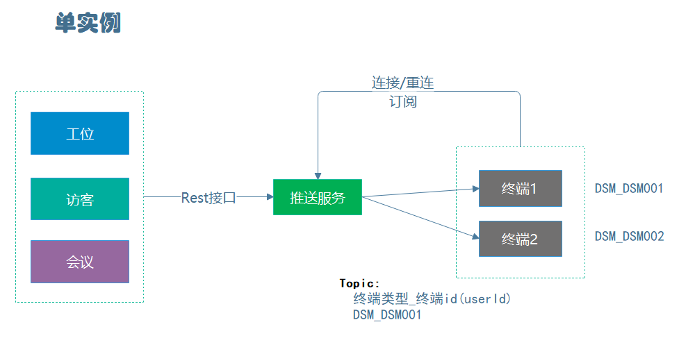
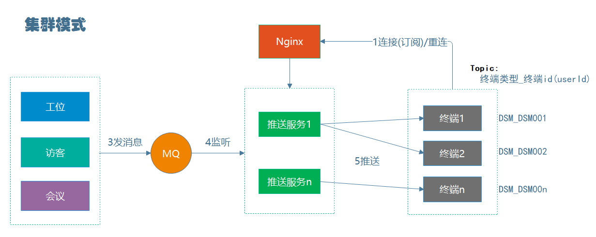
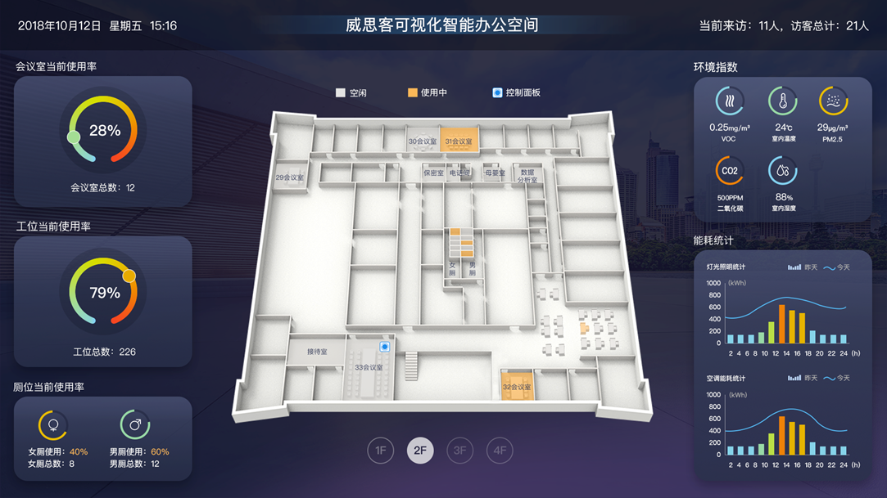

# 推送服务
> 基于WebSocket、STOMP、SockJS、发布订阅模式实现推送功能，兼容WebSocket与长轮询。

### 服务说明
- 单实例通过Rest接口为业务服务提供推送功能
- 集群模式业务服务通过RabbitMQ发布业务消息，推送服务监听消费，进行WebSocket消息推送

### 服务部署

#### 单实例部署
- application.yml中配置属性push.service.cluster = false

#### 集群部署（需要RabbitMQ支持）
- application.yml中配置属性push.service.cluster = true
- application.yml中配置RabbitMQ

#### 多产品接入说明
> 当某个前端页面集成多个产品的业务，均需要通过WebSocket推送消息。
> 通过页面创建一个WebSocket链接，订阅不同产品广播消息的Topic，来实现。

